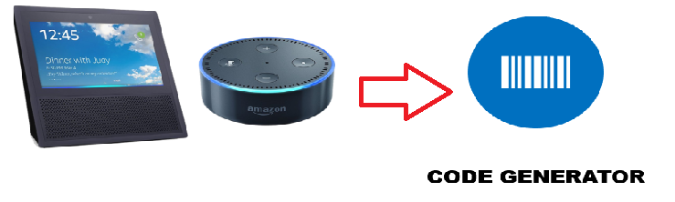

**Auto-generation programming Tool**

From natural language processing to self-driving cars, machine learning is changing the way we live-with computers. The impact of ML on software development, however, is largely untapped. We still write software by calling functions from an API or from scratch using our favorite programming languages with little change over the couple decades.

**In this project we will be aiming to address the following:-**

 - Collaborative human / computer programming
 - Using voice recognition for problem solving.
 - Application of machine learning for code generation
 - Application of machine learning to code recommendation and auto-completion, test generation.

****A platform to convert the MAPL to High Level Language** 

## Problem solved

 - Allow non technical competent to get production ready code.
 - Secure code generation
 - Veracode compliant code.
 - Industry compliant code will be generated.
 - Best practices for code generation
 - Build voice experiences and skills making the tasks fast and simple
  
 

## How it works

* User interacts with Alexa using triggers words to give a set of commands which may generate a project, class, functions etc.

* The intent engine using the Amazon lambda and Amazon S3 converts those commands into a JSON file.
* The Backend code generator parses the JSON into high level language i.e. C#, Java

### Architecture

## Technologies Used

Auto-generation programming Tool uses a number of technologies to work properly:

* [Amazon Lambda](https://aws.amazon.com/lambda/) - serverless compute service that runs your code in response to events.
* [Amazon S3 Bucket](https://aws.amazon.com/s3/) - public cloud storage resource available in Amazon Web services.
* [Amazon Polly](https://aws.amazon.com/polly/) -Amazon Polly is a cloud service by Amazon Web Services, a subsidiary of Amazon.com, that converts text into lifelike speech
* [REST API](https://restfulapi.net/) -Representational state transfer is a software architectural style that defines a set of constraints to be used for creating Web services. Web services that conform to the REST architectural style
* [JSON](https://en.wikipedia.org/wiki/JSON)-an open standard file format, and data interchange format, that uses human-readable text to store and transmit data objects consisting of attribute–value pairs and array data types
* [Amazon Lex](https://aws.amazon.com/lex/)- service for building conversational interfaces into any application using voice and text

## WoW factor

Currently we spend too much effort writing the code from scratch. Our solution will facilitate the approach of problem solving with most of the code generated in a very user friendly and simple approach. It may also revolutionize the future Innovate48 events letting the non-technical folks to be a part of this event by using the solution we propose.

